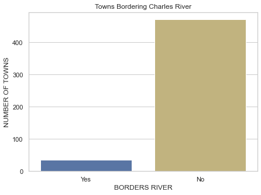

# IBM-Statistics-for-Data-Science

This is the final project for the [Statistics for Data Science Course by IBM](
https://www.coursera.org/learn/statistics-for-data-science-python) on [Coursera](https://www.coursera.org/)

## Project Overview

Statistics is an integral part in obtaining and communicating insights in Data Science. As part of a course focused on the Statistics used in Data Science, this final project aims to evaluate the learner's understanding of statistical concepts and their implementation in Python. The project uses Numpy, Pandas, Statsmodels and Scipy for data wrangling, whereas Matplotlib and Seaborn are used for data visualization.

The data used is the [Boston Housing Dataset](https://cf-courses-data.s3.us.cloud-object-storage.appdomain.cloud/IBMDeveloperSkillsNetwork-ST0151EN-SkillsNetwork/labs/boston_housing.csv') with 12 Features and 506 observations.

## Results of Statistical Analysis

From the statistical analysis, it was identified that most towns do not border Charles River. Only less than 50 towns border Charles River whereas more than 400 towns do not.

A T-Test was performed to check whether this status of bordering Charles River has statistical significance on the Median Value of houses. With a `P-Value of 0.004`, which is lesser than the required 0.05, it was proved that the median value of houses bordering Charles River is different from the Median Value of Houses that do not border Charles River. As such, the null hypothesis was rejected.
